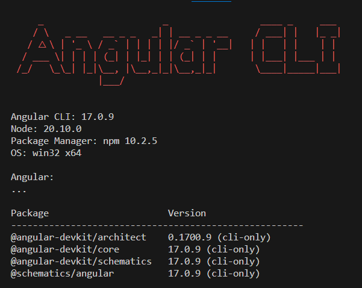
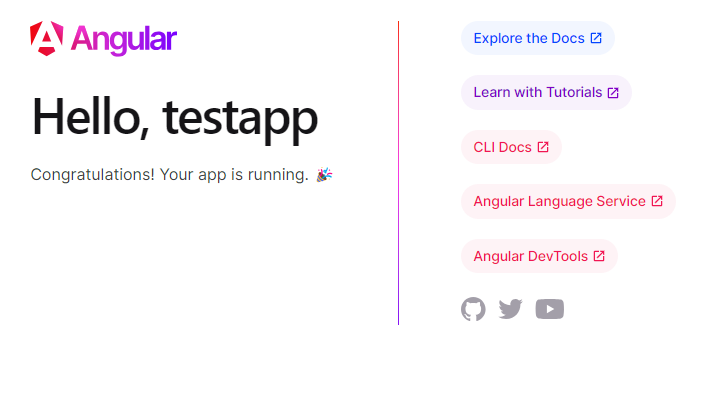
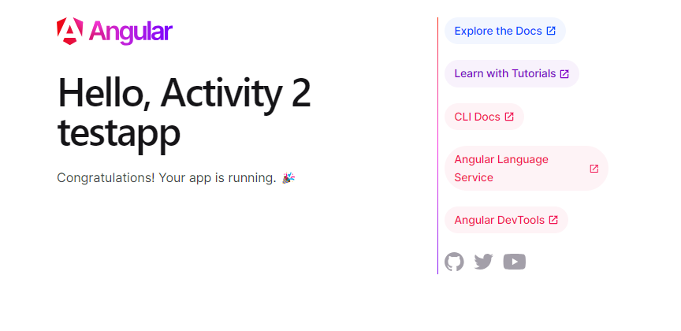
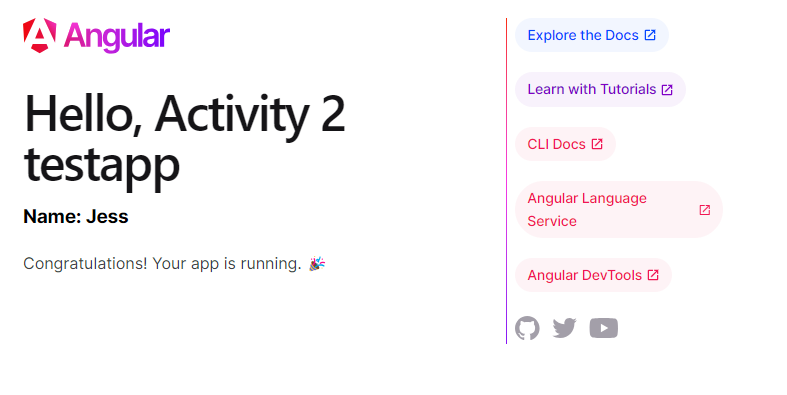

# CST391-Activity-2
## First Angular App

### Part 1: Install

### Part 2: Create App

Default Angular app

Title changed to "Activity 2 testapp"

Added the message "Name: Jess"

### Part 3: Research
##### a.	Inspect the default test project structure created in the Activity. Describe the purpose for each of the folders of the following in the project structure: node_modules, src, src/app, src/assets, and src/environments. Also, describe the purpose for each of the following files in the project: angular.json, package.json, and tsconfig.json
It is nice that Angular and Express create the main structure of a starter app for developers.
- node_modules contains all of the packages and dependencies that are needed for the app to run correctly.  These can be changed in the package.json, so there's no need to add the node_modules folder to git and should be added to a .gitignore file.  Then, when the repository is cloned, the developer only has to run npm install and the node_modules will be installed.
- src is the folder that contains the source code.
- src/app has the application code for the functionality and css stylesheets of the app.
- src/assets contains static files like images and fonts that should remain the same throughout the app
- src/environments I don't see the environments folder in my app, but it should contain environment specific items for development and/or production.
- angular.json has the settings for the project including paths, assets, and styles.  There is an option to change where the index file is located.
- package.json contains all of the dependencies so that they can be installed in the node_modules folder.  It also has data about the application name and version.
- tsconfig.json is the TypeScript configuration file.

##### b.	Inspect the page source for the default page displayed when running the test project. Explain how the resultant page was generated by Angular by providing a brief overview and purpose for each of the following files: main.ts, app.component.css, app.component.html, app.component.ts, and app.module.ts.

 - main.ts is the entry point of the application.  It calls the bootstrapApplication method with the AppComponent as the parameter. 
 - app.component.ts contains the AppComponent that has the title and message strings to print out on the page that is being rendered.
 - app.component.css contains the styles that define the way the elements look in the app.component.html.
 - app.component.html has the template for the HTML elements and placeholders that will be replaced later with dynamic elements.
 - app.module.ts imports the components that the application requires.